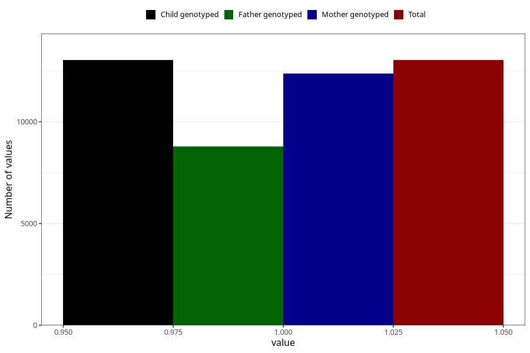

# common_cold_13w_15w
Variable mapping to `AA349` in `Skjema1_v12`.
- Number of values:

| Value | Total | Child genotyped | Mother genotyped | Father genotyped |
| ----- | ----- | --------------- | ---------------- | ---------------- |
| Missing | 62281 | 62281 | 59277 | 41291 |
| Non-missing | 13027 | 13027 | 12373 | 8793 |
| 1 | 13027 | 13027 | 12373 | 8793 |

