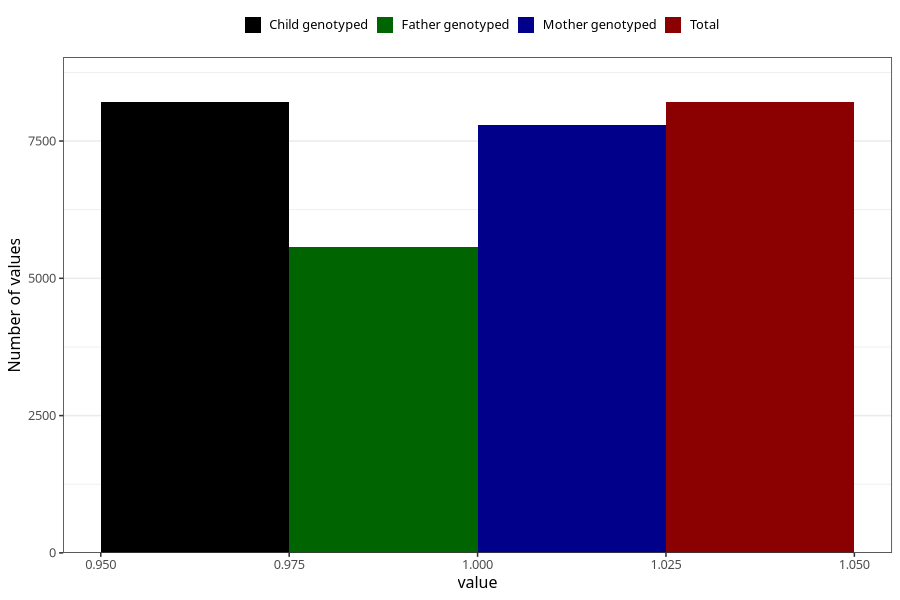

# common_cold_9w_12w
Variable mapping to `AA348` in `Skjema1_v12`.
- Number of values:

| Value | Total | Child genotyped | Mother genotyped | Father genotyped |
| ----- | ----- | --------------- | ---------------- | ---------------- |
| Missing | 67101 | 67101 | 63855 | 44517 |
| Non-missing | 8207 | 8207 | 7795 | 5567 |
| 1 | 8207 | 8207 | 7795 | 5567 |

