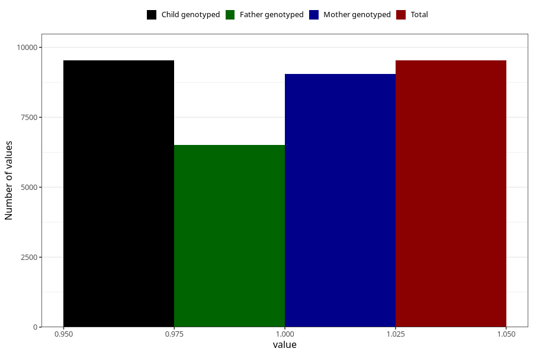

# constipation_13w_16w
Variable mapping to `CC436` in `Skjema3_v12`.
- Number of values:

| Value | Total | Child genotyped | Mother genotyped | Father genotyped |
| ----- | ----- | --------------- | ---------------- | ---------------- |
| Missing | 65776 | 65776 | 62606 | 43582 |
| Non-missing | 9532 | 9532 | 9044 | 6502 |
| 1 | 9532 | 9532 | 9044 | 6502 |

