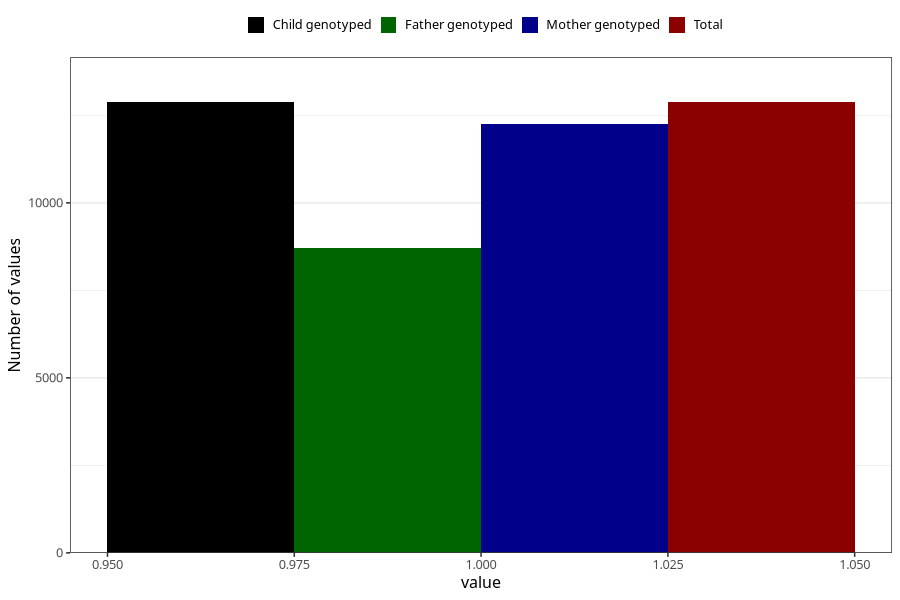

# constipation_21w_24w
Variable mapping to `CC438` in `Skjema3_v12`.
- Number of values:

| Value | Total | Child genotyped | Mother genotyped | Father genotyped |
| ----- | ----- | --------------- | ---------------- | ---------------- |
| Missing | 62432 | 62432 | 59406 | 41382 |
| Non-missing | 12876 | 12876 | 12244 | 8702 |
| 1 | 12876 | 12876 | 12244 | 8702 |

