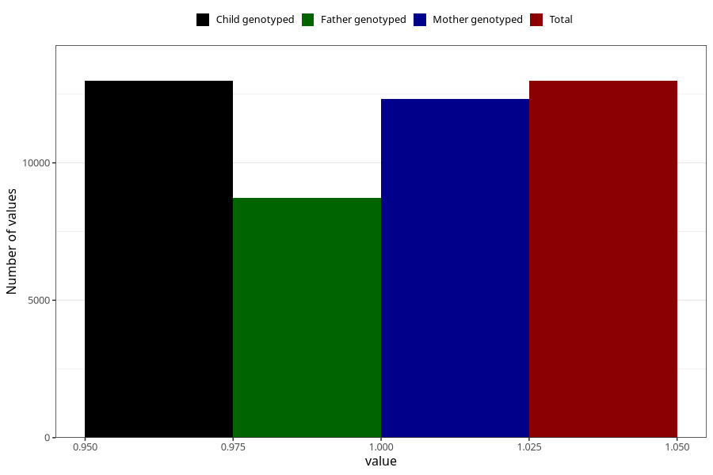

# constipation_5w_8w
Variable mapping to `AA267` in `Skjema1_v12`.
- Number of values:

| Value | Total | Child genotyped | Mother genotyped | Father genotyped |
| ----- | ----- | --------------- | ---------------- | ---------------- |
| Missing | 62327 | 62327 | 59338 | 41348 |
| Non-missing | 12981 | 12981 | 12312 | 8736 |
| 1 | 12981 | 12981 | 12312 | 8736 |

