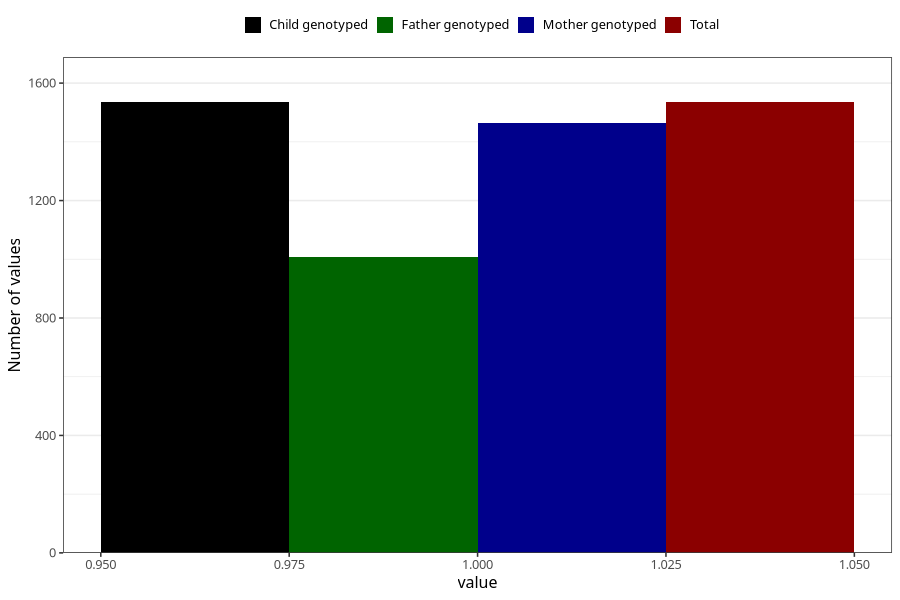

# diarrhoea_13w_16w
Variable mapping to `CC448` in `Skjema3_v12`.
- Number of values:

| Value | Total | Child genotyped | Mother genotyped | Father genotyped |
| ----- | ----- | --------------- | ---------------- | ---------------- |
| Missing | 73773 | 73773 | 70187 | 49075 |
| Non-missing | 1535 | 1535 | 1463 | 1009 |
| 1 | 1535 | 1535 | 1463 | 1009 |

