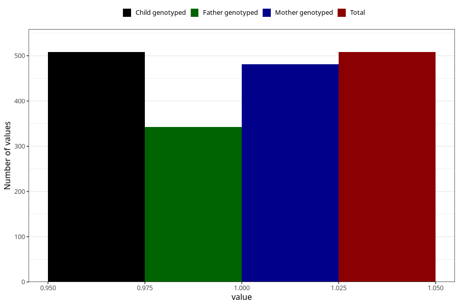

# fever_over385_before_4w
Variable mapping to `AA336` in `Skjema1_v12`.
- Number of values:

| Value | Total | Child genotyped | Mother genotyped | Father genotyped |
| ----- | ----- | --------------- | ---------------- | ---------------- |
| Missing | 74800 | 74800 | 71169 | 49742 |
| Non-missing | 508 | 508 | 481 | 342 |
| 1 | 508 | 508 | 481 | 342 |

