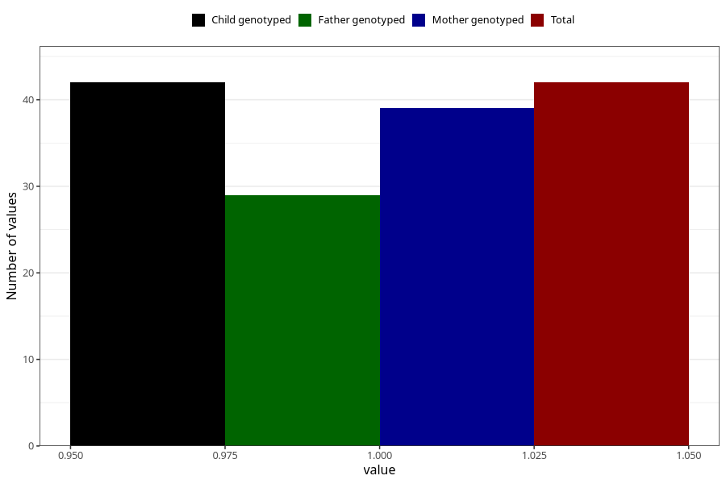

# fever_with_rash_13w_15w
Variable mapping to `AA329` in `Skjema1_v12`.
- Number of values:

| Value | Total | Child genotyped | Mother genotyped | Father genotyped |
| ----- | ----- | --------------- | ---------------- | ---------------- |
| Missing | 75266 | 75266 | 71611 | 50055 |
| Non-missing | 42 | 42 | 39 | 29 |
| 1 | 42 | 42 | 39 | 29 |

