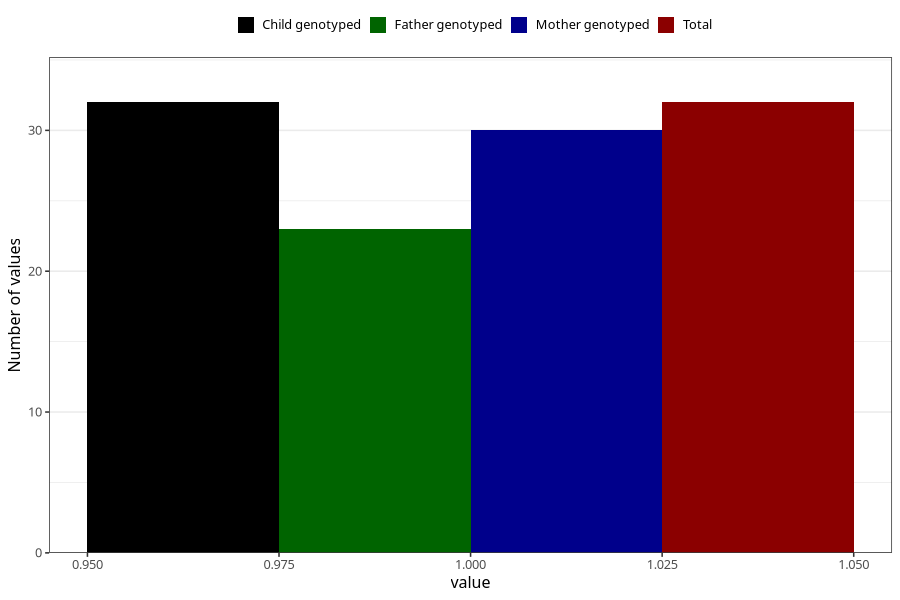

# fever_with_rash_before_4w
Variable mapping to `AA326` in `Skjema1_v12`.
- Number of values:

| Value | Total | Child genotyped | Mother genotyped | Father genotyped |
| ----- | ----- | --------------- | ---------------- | ---------------- |
| Missing | 75276 | 75276 | 71620 | 50061 |
| Non-missing | 32 | 32 | 30 | 23 |
| 1 | 32 | 32 | 30 | 23 |

