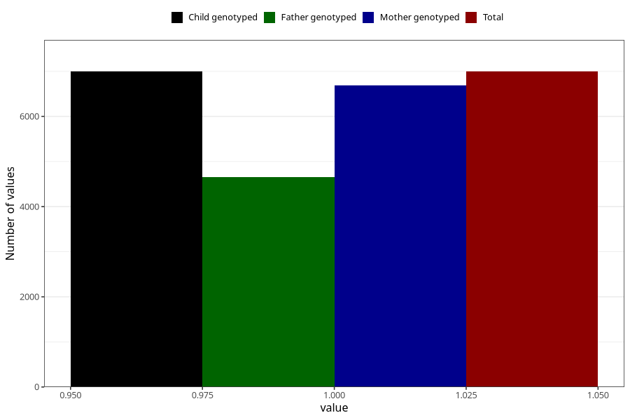

# heartburn_9w_12w
Variable mapping to `AA308` in `Skjema1_v12`.
- Number of values:

| Value | Total | Child genotyped | Mother genotyped | Father genotyped |
| ----- | ----- | --------------- | ---------------- | ---------------- |
| Missing | 68312 | 68312 | 64964 | 45422 |
| Non-missing | 6996 | 6996 | 6686 | 4662 |
| 1 | 6996 | 6996 | 6686 | 4662 |

