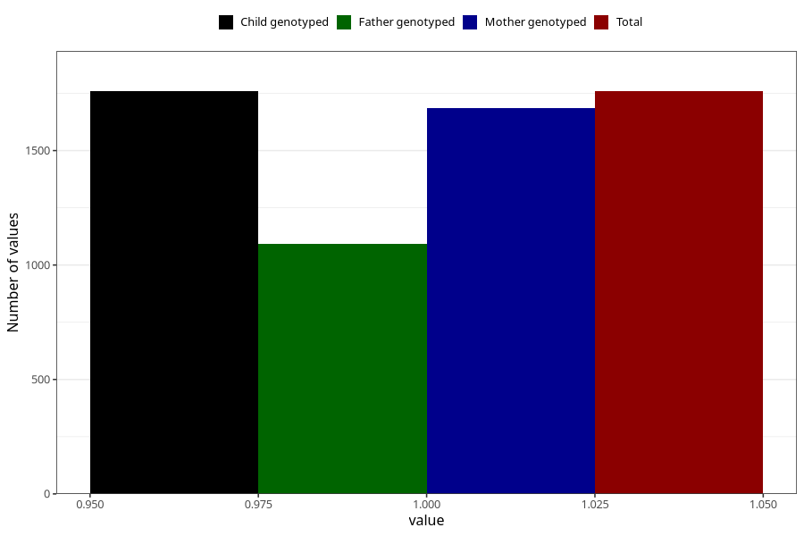

# heartburn_before_4w
Variable mapping to `AA306` in `Skjema1_v12`.
- Number of values:

| Value | Total | Child genotyped | Mother genotyped | Father genotyped |
| ----- | ----- | --------------- | ---------------- | ---------------- |
| Missing | 73549 | 73549 | 69966 | 48991 |
| Non-missing | 1759 | 1759 | 1684 | 1093 |
| 1 | 1759 | 1759 | 1684 | 1093 |

