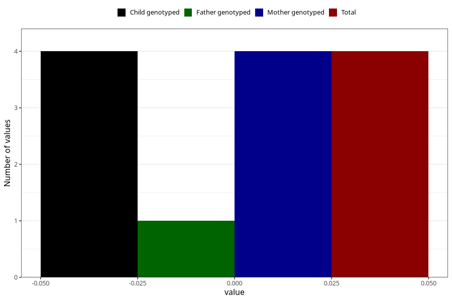

# high_blood_pressure_during_pregnancy_30w_2
Variable mapping to `CC1434` in `Skjema3_v12`.
- Number of values:

| Value | Total | Child genotyped | Mother genotyped | Father genotyped |
| ----- | ----- | --------------- | ---------------- | ---------------- |
| Missing | 71872 | 71872 | 68292 | 48972 |
| Non-missing | 3436 | 3436 | 3358 | 1112 |
| Do not know | 45 | 45 | 45 |10 |
| No | 3239 | 3239 | 3164 |1056 |
| Yes | 148 | 148 | 145 |45 |
| 0 | 4 | 4 | 4 | 1 |

