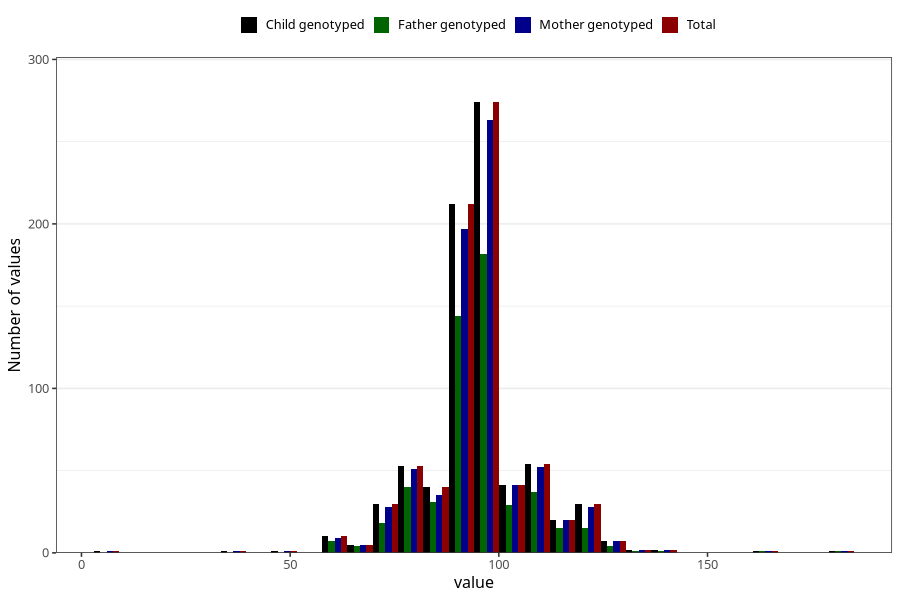

# highest_blood_pressure_before_pregnancy_diastolic
Variable mapping to `CC119` in `Skjema3_v12`.
- Number of values:

| Value | Total | Child genotyped | Mother genotyped | Father genotyped |
| ----- | ----- | --------------- | ---------------- | ---------------- |
| Missing | 74523 | 74523 | 70905 | 49554 |
| Non-missing | 785 | 785 | 745 | 530 |
| 25th percentile | 90 | 90 | 90 | 90 |
| 50th percentile | 95 | 95 | 95 | 95 |
| 75th percentile | 100 | 100 | 100 | 100 |
| Mean | 94.7821656050955 | 94.7821656050955 | 94.9530201342282 | 94.7358490566038 |
| Standard deviation | 13.4616684799231 | 13.4616684799231 | 13.550947061728 | 12.8481769147955 |
| N | 785 | 785 | 745 | 530 |

