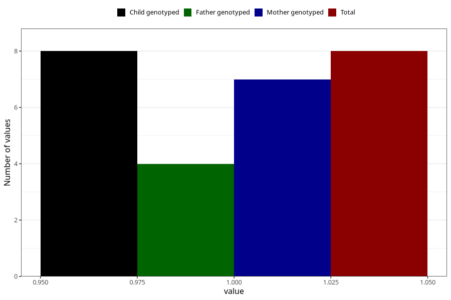

# hospitalized_amniotic_fluid_leakage_17_20w
Variable mapping to `CC160` in `Skjema3_v12`.
- Number of values:

| Value | Total | Child genotyped | Mother genotyped | Father genotyped |
| ----- | ----- | --------------- | ---------------- | ---------------- |
| Missing | 75300 | 75300 | 71643 | 50080 |
| Non-missing | 8 | 8 | 7 | 4 |
| 1 | 8 | 8 | 7 | 4 |

