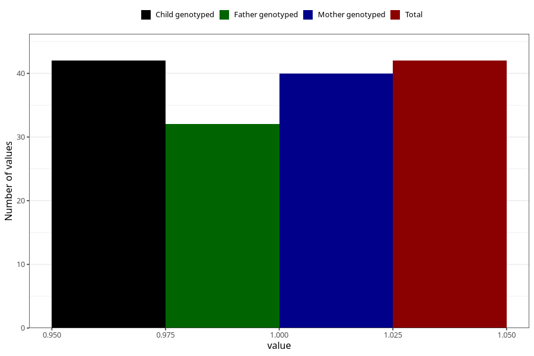

# hospitalized_bleeding_17_20w
Variable mapping to `CC151` in `Skjema3_v12`.
- Number of values:

| Value | Total | Child genotyped | Mother genotyped | Father genotyped |
| ----- | ----- | --------------- | ---------------- | ---------------- |
| Missing | 75266 | 75266 | 71610 | 50052 |
| Non-missing | 42 | 42 | 40 | 32 |
| 1 | 42 | 42 | 40 | 32 |

