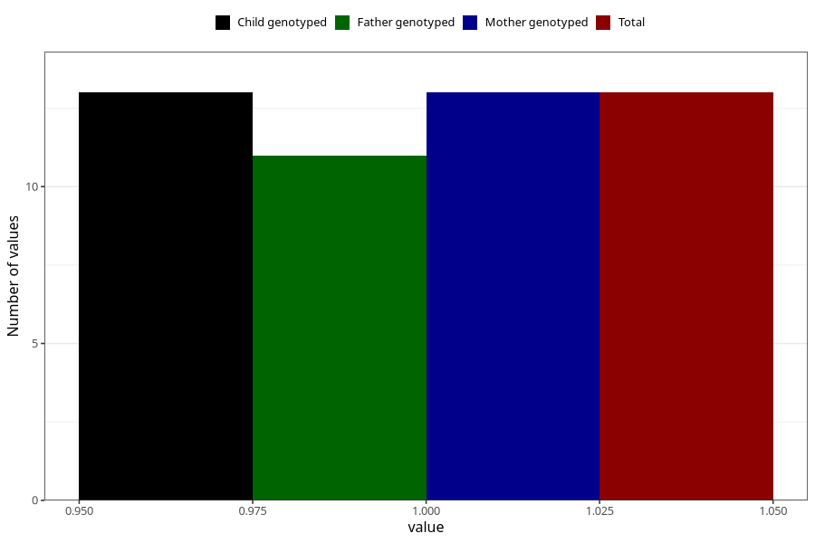

# hospitalized_high_blood_pressure_21_24w
Variable mapping to `CC179` in `Skjema3_v12`.
- Number of values:

| Value | Total | Child genotyped | Mother genotyped | Father genotyped |
| ----- | ----- | --------------- | ---------------- | ---------------- |
| Missing | 75295 | 75295 | 71637 | 50073 |
| Non-missing | 13 | 13 | 13 | 11 |
| 1 | 13 | 13 | 13 | 11 |

