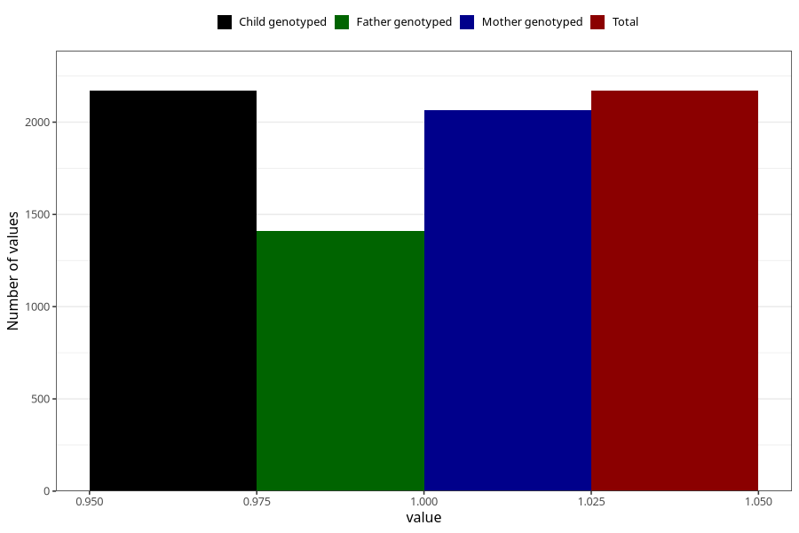

# hospitalized_other
Variable mapping to `CC191` in `Skjema3_v12`.
- Number of values:

| Value | Total | Child genotyped | Mother genotyped | Father genotyped |
| ----- | ----- | --------------- | ---------------- | ---------------- |
| Missing | 73138 | 73138 | 69585 | 48674 |
| Non-missing | 2170 | 2170 | 2065 | 1410 |
| 1 | 2170 | 2170 | 2065 | 1410 |

