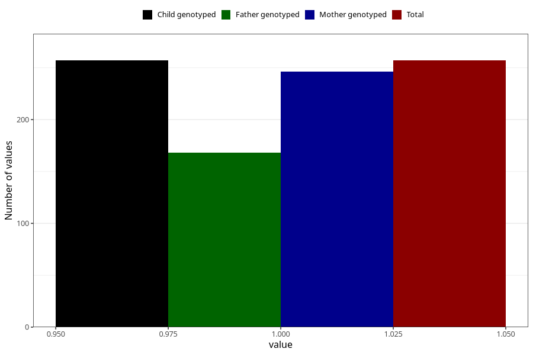

# hospitalized_other_17_20w
Variable mapping to `CC196` in `Skjema3_v12`.
- Number of values:

| Value | Total | Child genotyped | Mother genotyped | Father genotyped |
| ----- | ----- | --------------- | ---------------- | ---------------- |
| Missing | 75051 | 75051 | 71404 | 49916 |
| Non-missing | 257 | 257 | 246 | 168 |
| 1 | 257 | 257 | 246 | 168 |

