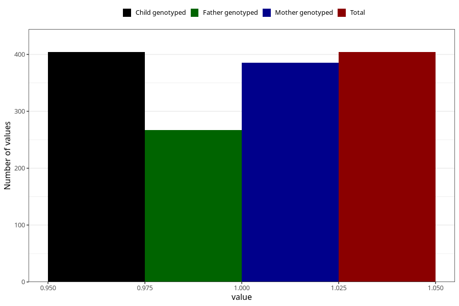

# hospitalized_other_after_29w
Variable mapping to `CC199` in `Skjema3_v12`.
- Number of values:

| Value | Total | Child genotyped | Mother genotyped | Father genotyped |
| ----- | ----- | --------------- | ---------------- | ---------------- |
| Missing | 74904 | 74904 | 71265 | 49817 |
| Non-missing | 404 | 404 | 385 | 267 |
| 1 | 404 | 404 | 385 | 267 |

