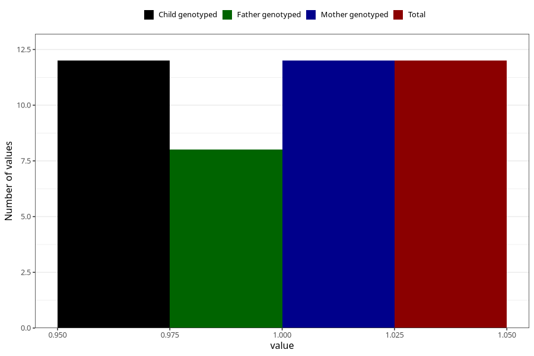

# hospitalized_pre_eclampsia_25_28w
Variable mapping to `CC189` in `Skjema3_v12`.
- Number of values:

| Value | Total | Child genotyped | Mother genotyped | Father genotyped |
| ----- | ----- | --------------- | ---------------- | ---------------- |
| Missing | 75296 | 75296 | 71638 | 50076 |
| Non-missing | 12 | 12 | 12 | 8 |
| 1 | 12 | 12 | 12 | 8 |

