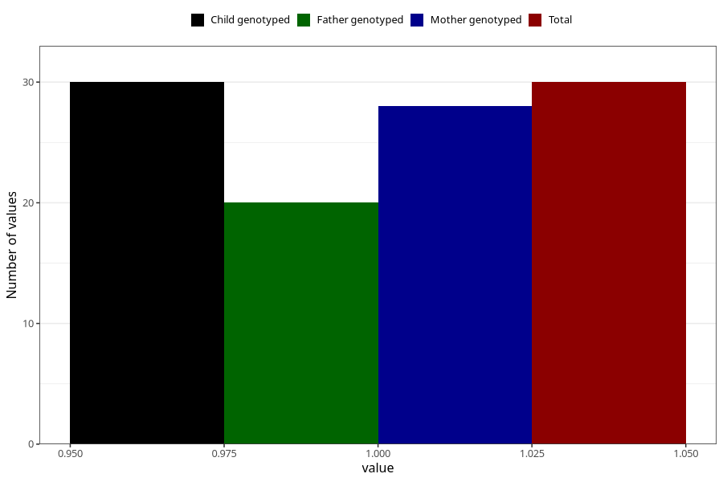

# hospitalized_pre_eclampsia_after_29w
Variable mapping to `CC190` in `Skjema3_v12`.
- Number of values:

| Value | Total | Child genotyped | Mother genotyped | Father genotyped |
| ----- | ----- | --------------- | ---------------- | ---------------- |
| Missing | 75278 | 75278 | 71622 | 50064 |
| Non-missing | 30 | 30 | 28 | 20 |
| 1 | 30 | 30 | 28 | 20 |

