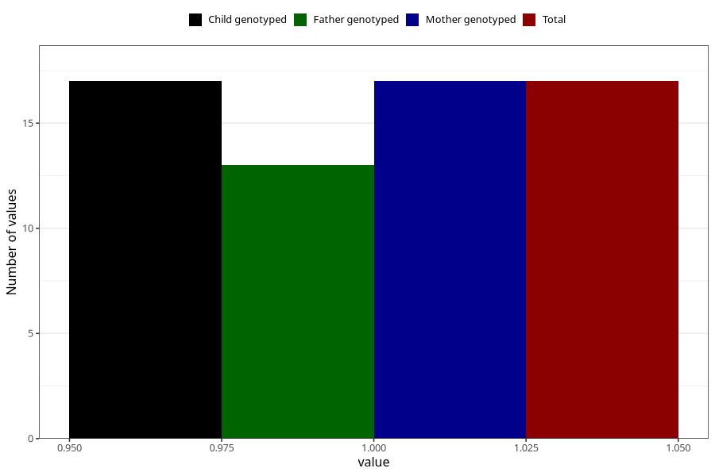

# hospitalized_prolonged_nausea_vomiting_after_29w
Variable mapping to `CC145` in `Skjema3_v12`.
- Number of values:

| Value | Total | Child genotyped | Mother genotyped | Father genotyped |
| ----- | ----- | --------------- | ---------------- | ---------------- |
| Missing | 75291 | 75291 | 71633 | 50071 |
| Non-missing | 17 | 17 | 17 | 13 |
| 1 | 17 | 17 | 17 | 13 |

