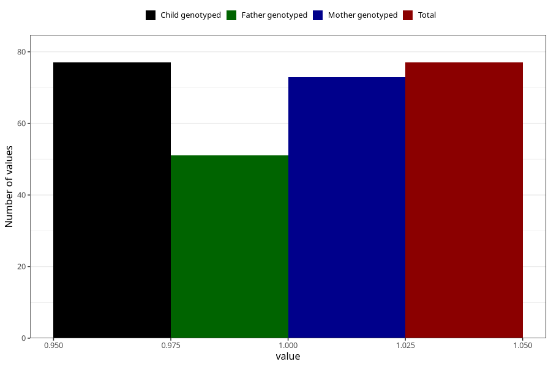

# hospitalized_threatening_preterm_labour_21_24w
Variable mapping to `CC170` in `Skjema3_v12`.
- Number of values:

| Value | Total | Child genotyped | Mother genotyped | Father genotyped |
| ----- | ----- | --------------- | ---------------- | ---------------- |
| Missing | 75231 | 75231 | 71577 | 50033 |
| Non-missing | 77 | 77 | 73 | 51 |
| 1 | 77 | 77 | 73 | 51 |

