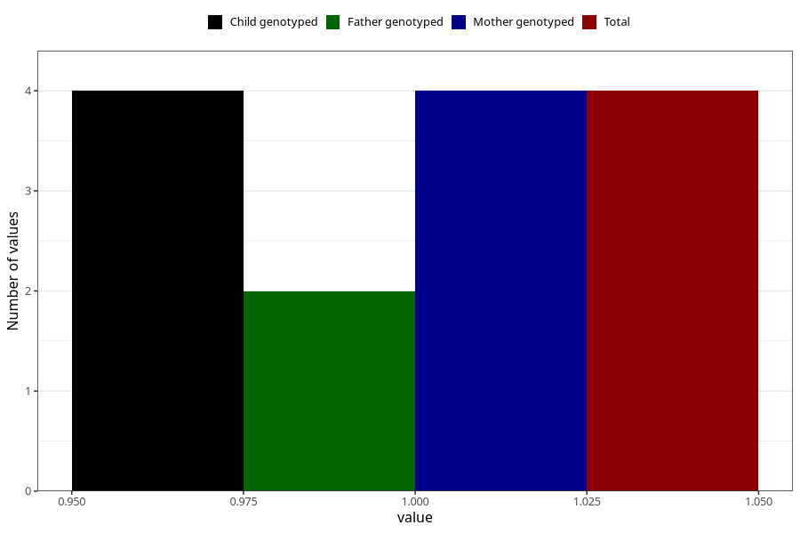

# hospitalized_threatening_preterm_labour_9_12w
Variable mapping to `CC167` in `Skjema3_v12`.
- Number of values:

| Value | Total | Child genotyped | Mother genotyped | Father genotyped |
| ----- | ----- | --------------- | ---------------- | ---------------- |
| Missing | 75304 | 75304 | 71646 | 50082 |
| Non-missing | 4 | 4 | 4 | 2 |
| 1 | 4 | 4 | 4 | 2 |

