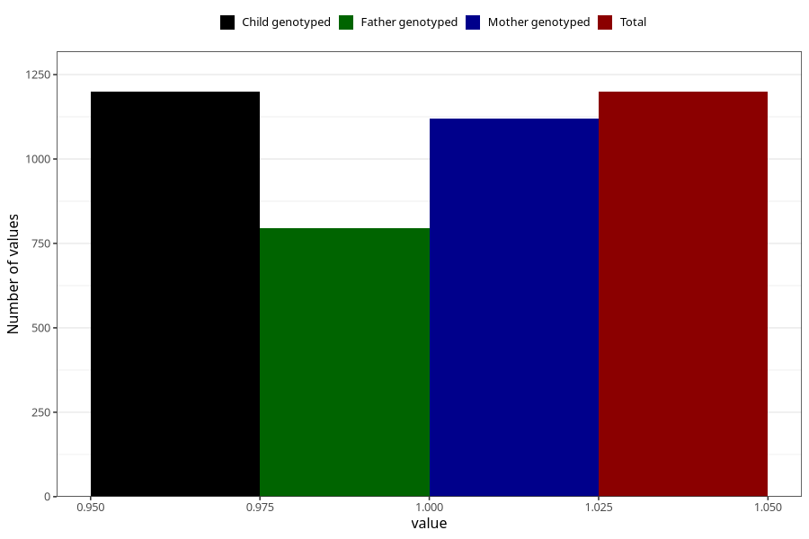

# influenza_9w_12w
Variable mapping to `AA378` in `Skjema1_v12`.
- Number of values:

| Value | Total | Child genotyped | Mother genotyped | Father genotyped |
| ----- | ----- | --------------- | ---------------- | ---------------- |
| Missing | 74109 | 74109 | 70529 | 49289 |
| Non-missing | 1199 | 1199 | 1121 | 795 |
| 1 | 1199 | 1199 | 1121 | 795 |

