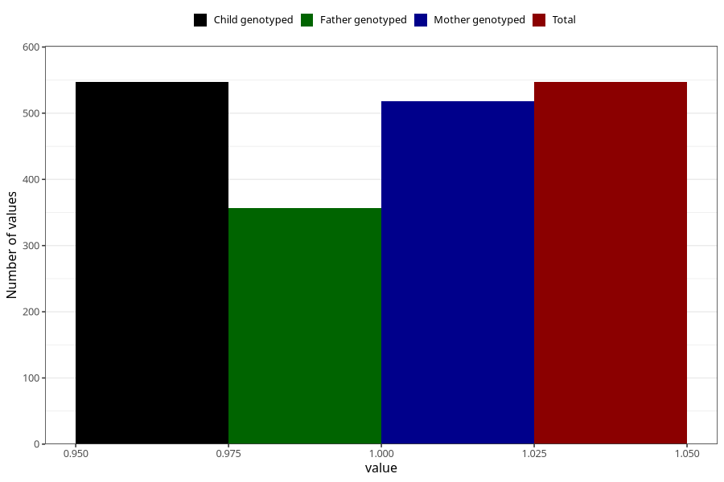

# influenza_before_4w
Variable mapping to `AA376` in `Skjema1_v12`.
- Number of values:

| Value | Total | Child genotyped | Mother genotyped | Father genotyped |
| ----- | ----- | --------------- | ---------------- | ---------------- |
| Missing | 74761 | 74761 | 71132 | 49727 |
| Non-missing | 547 | 547 | 518 | 357 |
| 1 | 547 | 547 | 518 | 357 |

