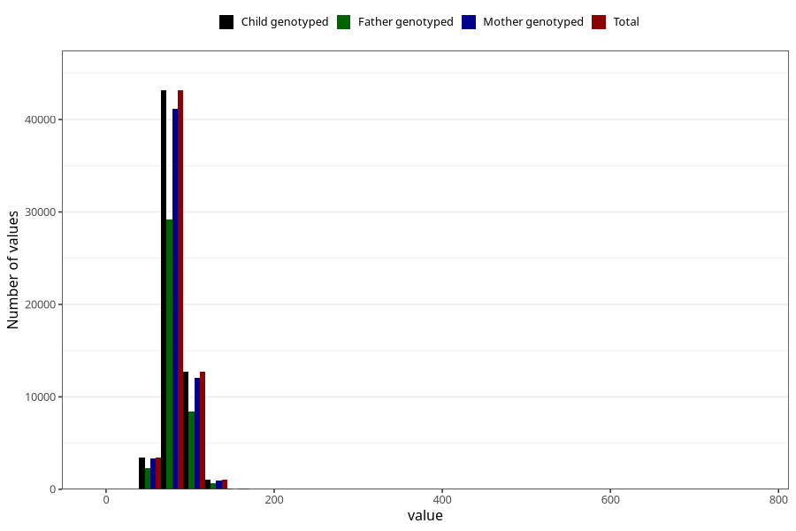

# mother_weight_end_self
Variable mapping to `DD672` in `Skjema4_6mnd_v12`.
- Number of values:

| Value | Total | Child genotyped | Mother genotyped | Father genotyped |
| ----- | ----- | --------------- | ---------------- | ---------------- |
| Missing | 14949 | 14949 | 14174 | 9446 |
| Non-missing | 60359 | 60359 | 57476 | 40638 |
| 25th percentile | 74 | 74 | 74 | 74 |
| 50th percentile | 81 | 81 | 81 | 81 |
| 75th percentile | 90 | 90 | 90 | 90 |
| Mean | 83.0122152454481 | 83.0122152454481 | 82.9817436843204 | 82.9229415817708 |
| Standard deviation | 13.4698077415915 | 13.4698077415915 | 13.4584156684052 | 13.1059221462615 |
| N | 60359 | 60359 | 57476 | 40638 |

