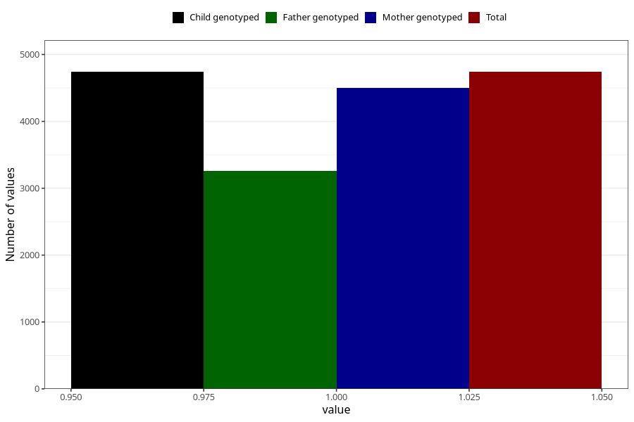

# nausea_21w_24w
Variable mapping to `CC378` in `Skjema3_v12`.
- Number of values:

| Value | Total | Child genotyped | Mother genotyped | Father genotyped |
| ----- | ----- | --------------- | ---------------- | ---------------- |
| Missing | 70568 | 70568 | 67146 | 46824 |
| Non-missing | 4740 | 4740 | 4504 | 3260 |
| 1 | 4740 | 4740 | 4504 | 3260 |

