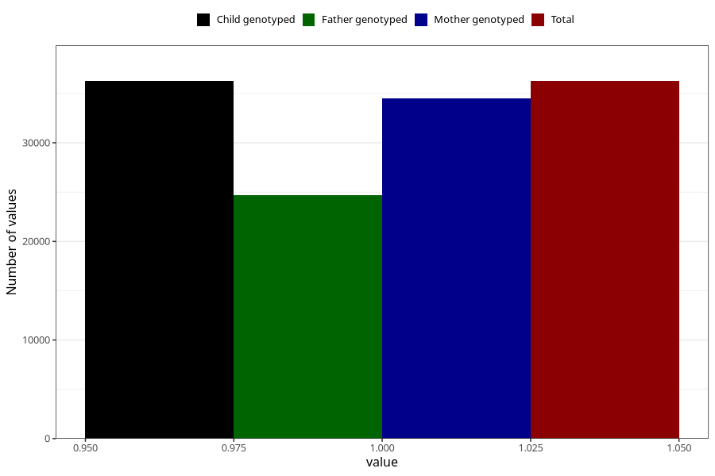

# nausea_9w_12w
Variable mapping to `AA218` in `Skjema1_v12`.
- Number of values:

| Value | Total | Child genotyped | Mother genotyped | Father genotyped |
| ----- | ----- | --------------- | ---------------- | ---------------- |
| Missing | 39050 | 39050 | 37141 | 25364 |
| Non-missing | 36258 | 36258 | 34509 | 24720 |
| 1 | 36258 | 36258 | 34509 | 24720 |

