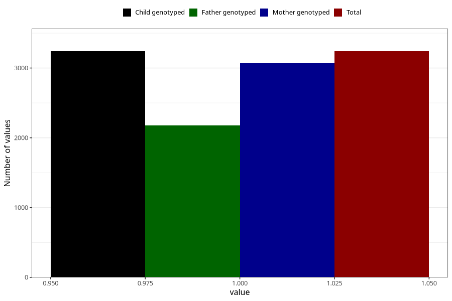

# other_muscle_joint_pain_17w_20w
Variable mapping to `CC365` in `Skjema3_v12`.
- Number of values:

| Value | Total | Child genotyped | Mother genotyped | Father genotyped |
| ----- | ----- | --------------- | ---------------- | ---------------- |
| Missing | 72068 | 72068 | 68582 | 47907 |
| Non-missing | 3240 | 3240 | 3068 | 2177 |
| 1 | 3240 | 3240 | 3068 | 2177 |

