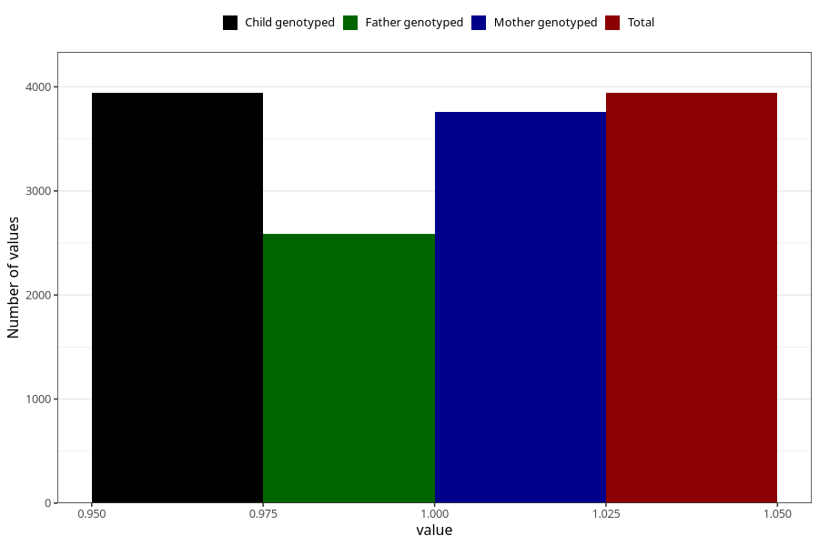

# pelvic_girdle_pain_9w_12w
Variable mapping to `AA178` in `Skjema1_v12`.
- Number of values:

| Value | Total | Child genotyped | Mother genotyped | Father genotyped |
| ----- | ----- | --------------- | ---------------- | ---------------- |
| Missing | 71367 | 71367 | 67888 | 47493 |
| Non-missing | 3941 | 3941 | 3762 | 2591 |
| 1 | 3941 | 3941 | 3762 | 2591 |

