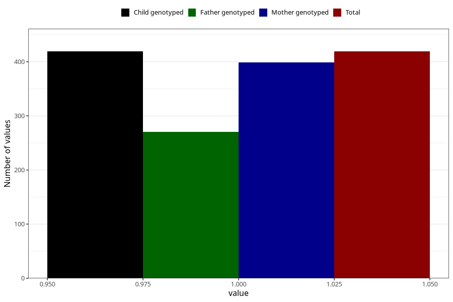

# pneumonia_bronchitis_13w_15w
Variable mapping to `AA389` in `Skjema1_v12`.
- Number of values:

| Value | Total | Child genotyped | Mother genotyped | Father genotyped |
| ----- | ----- | --------------- | ---------------- | ---------------- |
| Missing | 74889 | 74889 | 71251 | 49814 |
| Non-missing | 419 | 419 | 399 | 270 |
| 1 | 419 | 419 | 399 | 270 |

