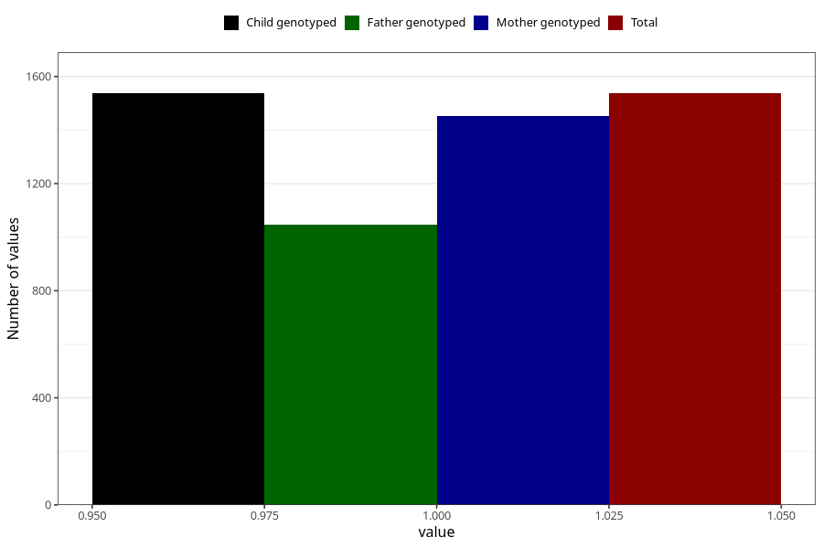

# protein_in_urine_13w_15w
Variable mapping to `AA409` in `Skjema1_v12`.
- Number of values:

| Value | Total | Child genotyped | Mother genotyped | Father genotyped |
| ----- | ----- | --------------- | ---------------- | ---------------- |
| Missing | 73771 | 73771 | 70196 | 49038 |
| Non-missing | 1537 | 1537 | 1454 | 1046 |
| 1 | 1537 | 1537 | 1454 | 1046 |

