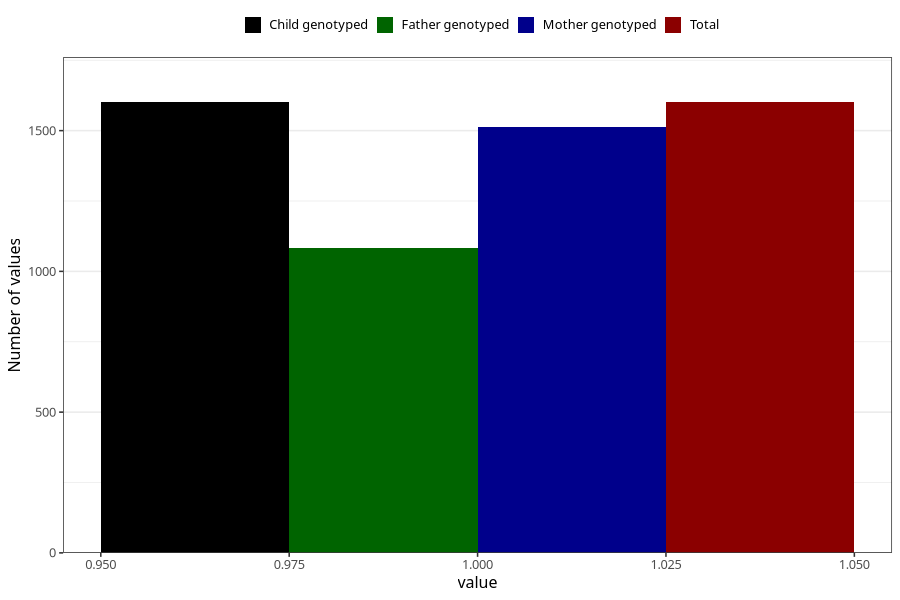

# sinusitis_ear_infection_13w_15w
Variable mapping to `AA369` in `Skjema1_v12`.
- Number of values:

| Value | Total | Child genotyped | Mother genotyped | Father genotyped |
| ----- | ----- | --------------- | ---------------- | ---------------- |
| Missing | 73707 | 73707 | 70136 | 49002 |
| Non-missing | 1601 | 1601 | 1514 | 1082 |
| 1 | 1601 | 1601 | 1514 | 1082 |

