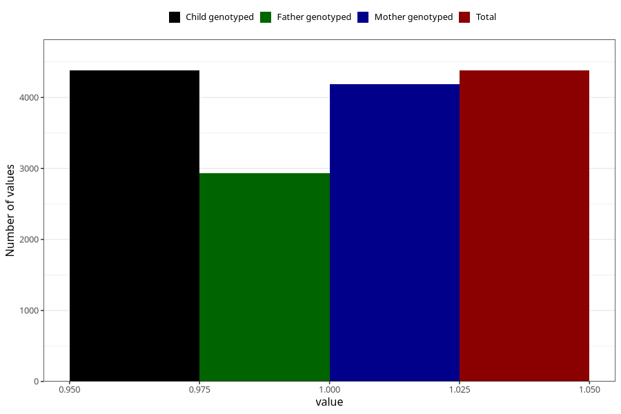

# sleeping_problems_5w_8w
Variable mapping to `AA297` in `Skjema1_v12`.
- Number of values:

| Value | Total | Child genotyped | Mother genotyped | Father genotyped |
| ----- | ----- | --------------- | ---------------- | ---------------- |
| Missing | 70928 | 70928 | 67467 | 47150 |
| Non-missing | 4380 | 4380 | 4183 | 2934 |
| 1 | 4380 | 4380 | 4183 | 2934 |

