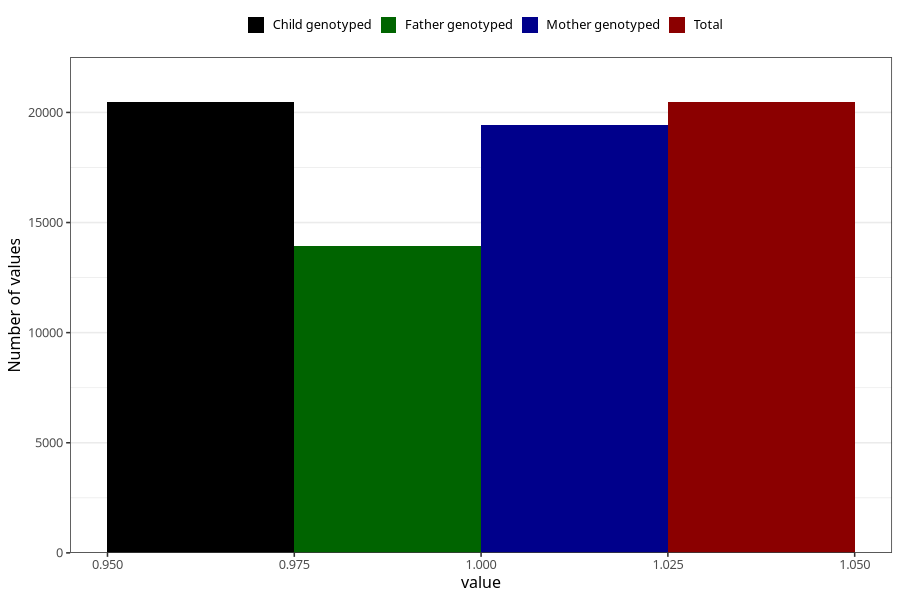

# unusual_tiredness_13w_15w
Variable mapping to `AA289` in `Skjema1_v12`.
- Number of values:

| Value | Total | Child genotyped | Mother genotyped | Father genotyped |
| ----- | ----- | --------------- | ---------------- | ---------------- |
| Missing | 54844 | 54844 | 52220 | 36170 |
| Non-missing | 20464 | 20464 | 19430 | 13914 |
| 1 | 20464 | 20464 | 19430 | 13914 |

