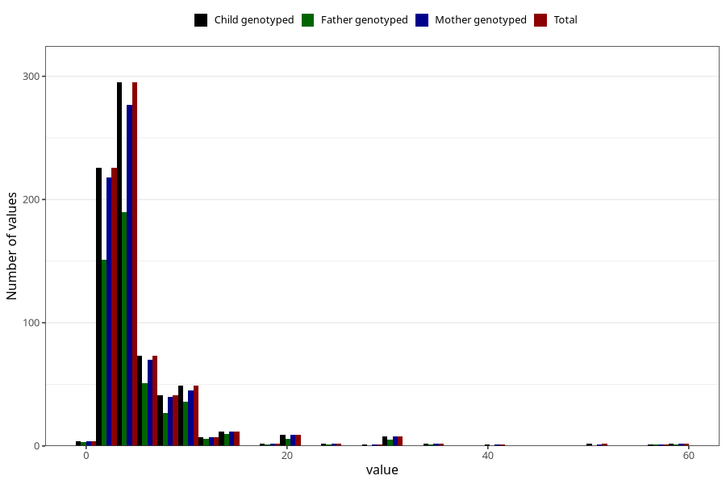

# vaginal_bleeding_more_than_two_episodes_n
Variable mapping to `CC331` in `Skjema3_v12`.
- Number of values:

| Value | Total | Child genotyped | Mother genotyped | Father genotyped |
| ----- | ----- | --------------- | ---------------- | ---------------- |
| Missing | 74571 | 74571 | 70948 | 49594 |
| Non-missing | 737 | 737 | 702 | 490 |
| 25th percentile | 3 | 3 | 3 | 3 |
| 50th percentile | 4 | 4 | 4 | 4 |
| 75th percentile | 6 | 6 | 6 | 6 |
| Mean | 6.01356852103121 | 6.01356852103121 | 6 | 5.85714285714286 |
| Standard deviation | 6.19210844135037 | 6.19210844135037 | 6.09950770914062 | 5.46975323108803 |
| N | 737 | 737 | 702 | 490 |

