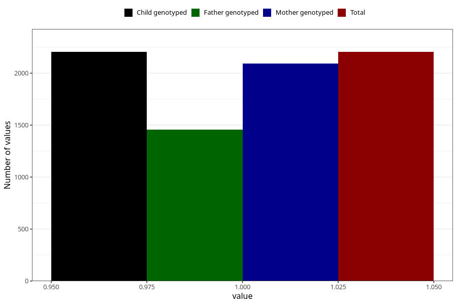

# vaginal_catarrh_unusual_discharge_13w_15w
Variable mapping to `AA249` in `Skjema1_v12`.
- Number of values:

| Value | Total | Child genotyped | Mother genotyped | Father genotyped |
| ----- | ----- | --------------- | ---------------- | ---------------- |
| Missing | 73104 | 73104 | 69559 | 48625 |
| Non-missing | 2204 | 2204 | 2091 | 1459 |
| 1 | 2204 | 2204 | 2091 | 1459 |

