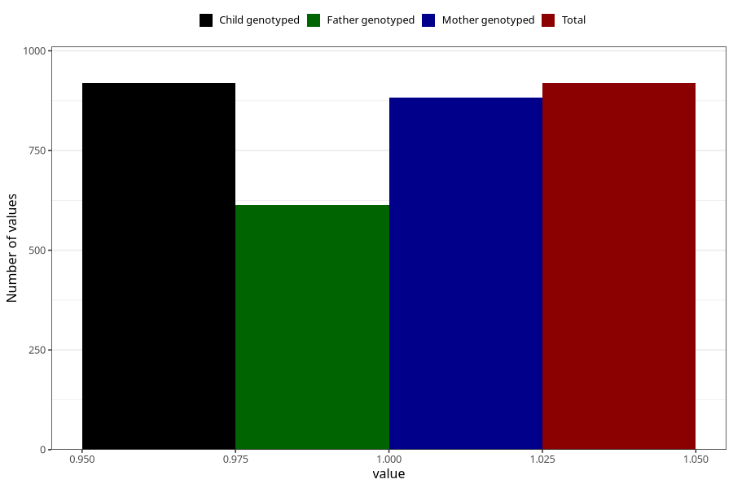

# vaginal_catarrh_unusual_discharge_13w_16w
Variable mapping to `CC412` in `Skjema3_v12`.
- Number of values:

| Value | Total | Child genotyped | Mother genotyped | Father genotyped |
| ----- | ----- | --------------- | ---------------- | ---------------- |
| Missing | 74389 | 74389 | 70768 | 49470 |
| Non-missing | 919 | 919 | 882 | 614 |
| 1 | 919 | 919 | 882 | 614 |

