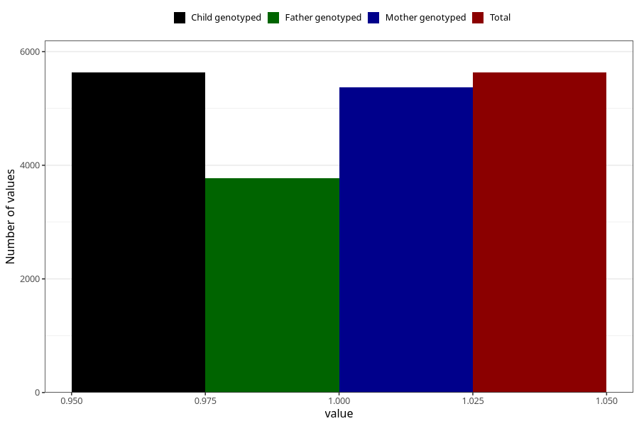

# vaginal_thrush_13w_15w
Variable mapping to `AA239` in `Skjema1_v12`.
- Number of values:

| Value | Total | Child genotyped | Mother genotyped | Father genotyped |
| ----- | ----- | --------------- | ---------------- | ---------------- |
| Missing | 69677 | 69677 | 66282 | 46317 |
| Non-missing | 5631 | 5631 | 5368 | 3767 |
| 1 | 5631 | 5631 | 5368 | 3767 |

