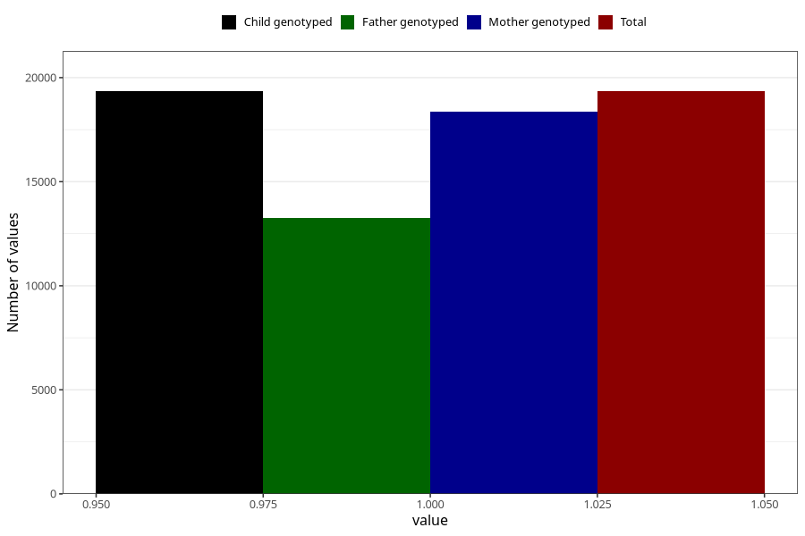

# vomiting_9w_12w
Variable mapping to `AA228` in `Skjema1_v12`.
- Number of values:

| Value | Total | Child genotyped | Mother genotyped | Father genotyped |
| ----- | ----- | --------------- | ---------------- | ---------------- |
| Missing | 55965 | 55965 | 53294 | 36834 |
| Non-missing | 19343 | 19343 | 18356 | 13250 |
| 1 | 19343 | 19343 | 18356 | 13250 |

