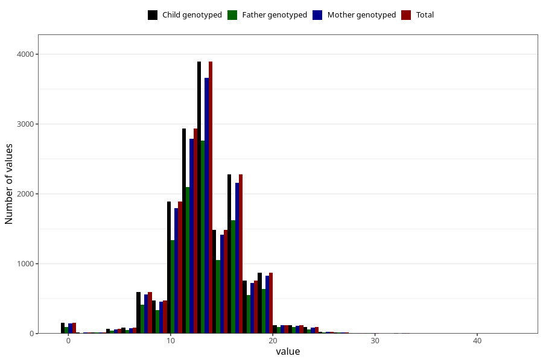

# vomiting_week_to_q2
Variable mapping to `BB858` in `Skjema2CDW_v12`.
- Number of values:

| Value | Total | Child genotyped | Mother genotyped | Father genotyped |
| ----- | ----- | --------------- | ---------------- | ---------------- |
| Missing | 59374 | 59374 | 56567 | 38760 |
| Non-missing | 15934 | 15934 | 15083 | 11324 |
| 25th percentile | 12 | 12 | 12 | 12 |
| 50th percentile | 13 | 13 | 13 | 14 |
| 75th percentile | 16 | 16 | 16 | 16 |
| Mean | 13.6230074055479 | 13.6230074055479 | 13.6220247961281 | 13.6684916990463 |
| Standard deviation | 3.60370045493206 | 3.60370045493206 | 3.60505622766642 | 3.56067402698843 |
| N | 15934 | 15934 | 15083 | 11324 |

