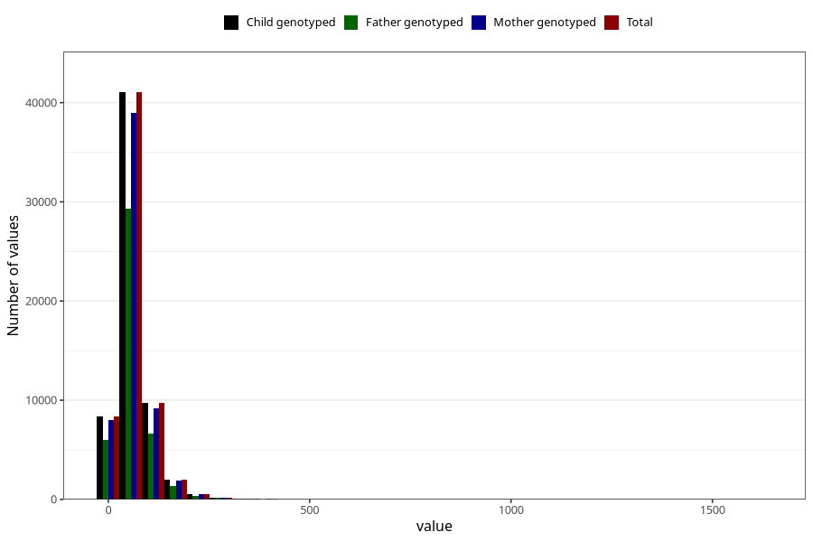

# added_sugar
Variable mapping to `SUKKER` in `Skjema2_beregning_CDW_v12`.
- Number of values:

| Value | Total | Child genotyped | Mother genotyped | Father genotyped |
| ----- | ----- | --------------- | ---------------- | ---------------- |
| Missing | 13178 | 13178 | 12654 | 6217 |
| Non-missing | 62130 | 62130 | 58996 | 43867 |
| 25th percentile | 36.31 | 36.31 | 36.29 | 36.07 |
| 50th percentile | 53.02 | 53.02 | 52.99 | 52.45 |
| 75th percentile | 76.88 | 76.88 | 76.84 | 75.72 |
| Mean | 63.0266170931917 | 63.0266170931917 | 62.9591560444776 | 61.9435313561447 |
| Standard deviation | 45.0797029819764 | 45.0797029819764 | 44.8967403747832 | 43.2991211672399 |
| N | 62130 | 62130 | 58996 | 43867 |

