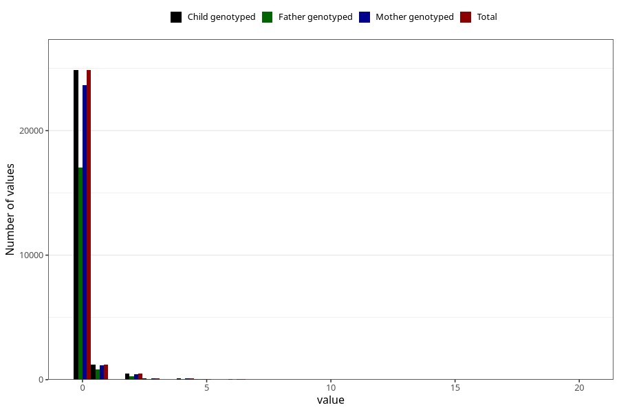

# coffee_during_boiled
Variable mapping to `AA1384` in `Skjema1_v12`.
- Number of values:

| Value | Total | Child genotyped | Mother genotyped | Father genotyped |
| ----- | ----- | --------------- | ---------------- | ---------------- |
| Missing | 48486 | 48486 | 46113 | 31784 |
| Non-missing | 26822 | 26822 | 25537 | 18300 |
| Consumption have been reported by a mark but no amount given | 1 | 1 | 1 |0 |
| 0 | 24860 | 24860 | 23668 | 17026 |
| 1 | 1180 | 1180 | 1134 | 807 |
| 2 | 483 | 483 | 459 | 296 |
| 3 | 105 | 105 | 97 | 64 |
| 4 | 94 | 94 | 89 | 52 |
| 5 | 41 | 41 | 35 | 23 |
| 6 | 28 | 28 | 28 | 20 |
| 7 | 6 | 6 | 4 | 2 |
| 8 | 8 | 8 | 8 | 2 |
| 10 | 11 | 11 | 9 | 6 |
| 12 | 2 | 2 | 2 | 0 |
| 15 | 1 | 1 | 1 | 1 |
| 16 | 1 | 1 | 1 | 1 |
| 20 | 1 | 1 | 1 | 0 |

