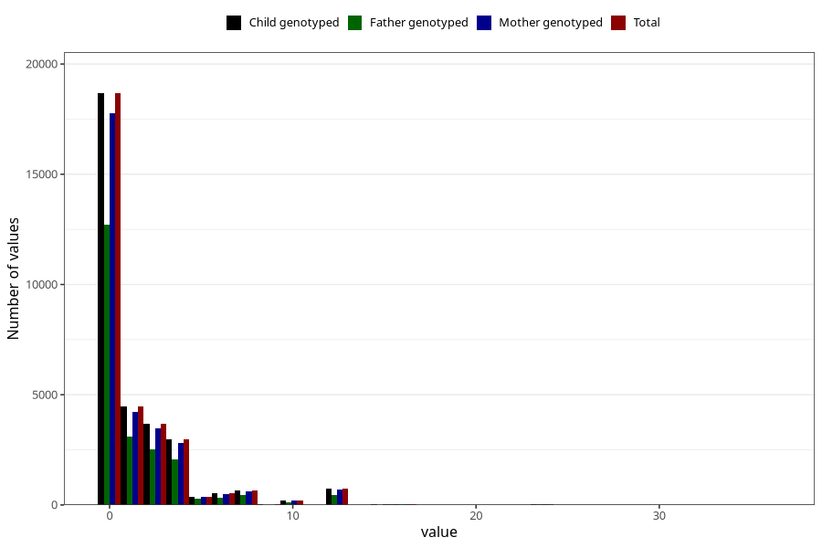

# diet_coke_before
Variable mapping to `AA1398` in `Skjema1_v12`.
- Number of values:

| Value | Total | Child genotyped | Mother genotyped | Father genotyped |
| ----- | ----- | --------------- | ---------------- | ---------------- |
| Missing | 42890 | 42890 | 40815 | 27928 |
| Non-missing | 32418 | 32418 | 30835 | 22156 |
| Consumption have been reported by a mark but no amount given | 2 | 2 | 2 |1 |
| 25th percentile | 0 | 0 | 0 | 0 |
| 50th percentile | 0 | 0 | 0 | 0 |
| 75th percentile | 2 | 2 | 2 | 2 |
| Mean | 1.48432872655479 | 1.48432872655479 | 1.48357279538157 | 1.45854208982171 |
| Standard deviation | 2.76923691909626 | 2.76923691909626 | 2.76979553530056 | 2.69305318826705 |
| N | 32416 | 32416 | 30833 | 22155 |

