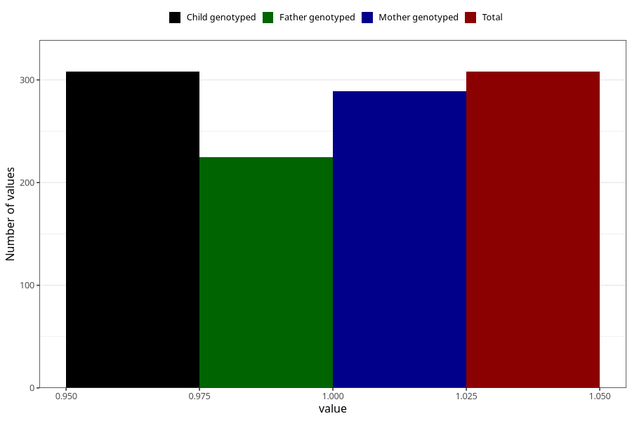

# diet_soda_decaf
Variable mapping to `AA1403` in `Skjema1_v12`.
- Number of values:

| Value | Total | Child genotyped | Mother genotyped | Father genotyped |
| ----- | ----- | --------------- | ---------------- | ---------------- |
| Missing | 75000 | 75000 | 71361 | 49859 |
| Non-missing | 308 | 308 | 289 | 225 |
| 1 | 308 | 308 | 289 | 225 |

