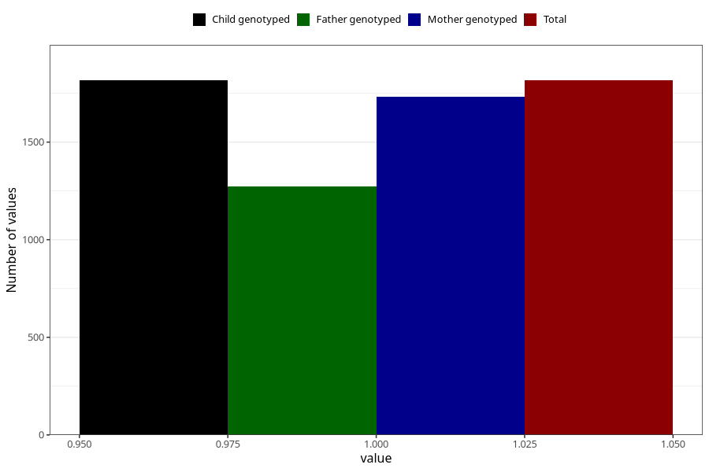

# herbal_tea_decaf
Variable mapping to `AA1391` in `Skjema1_v12`.
- Number of values:

| Value | Total | Child genotyped | Mother genotyped | Father genotyped |
| ----- | ----- | --------------- | ---------------- | ---------------- |
| Missing | 73492 | 73492 | 69918 | 48813 |
| Non-missing | 1816 | 1816 | 1732 | 1271 |
| 1 | 1816 | 1816 | 1732 | 1271 |

