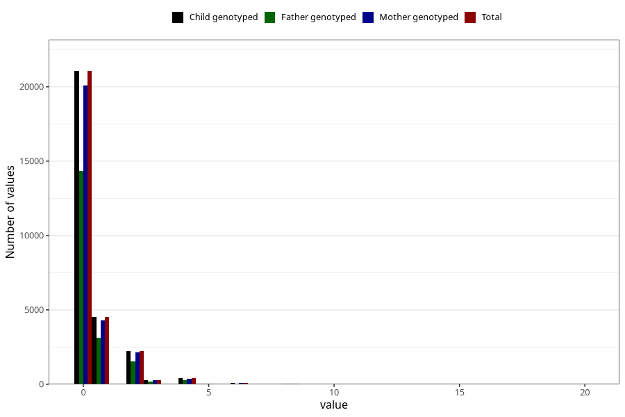

# herbal_tea_during
Variable mapping to `AA1390` in `Skjema1_v12`.
- Number of values:

| Value | Total | Child genotyped | Mother genotyped | Father genotyped |
| ----- | ----- | --------------- | ---------------- | ---------------- |
| Missing | 46588 | 46588 | 44297 | 30505 |
| Non-missing | 28720 | 28720 | 27353 | 19579 |
| 0 | 21057 | 21057 | 20072 | 14359 |
| 1 | 4531 | 4531 | 4308 | 3139 |
| 2 | 2232 | 2232 | 2129 | 1517 |
| 3 | 282 | 282 | 265 | 171 |
| 4 | 411 | 411 | 391 | 274 |
| 5 | 48 | 48 | 43 | 29 |
| 6 | 98 | 98 | 89 | 54 |
| 7 | 8 | 8 | 8 | 4 |
| 8 | 33 | 33 | 31 | 19 |
| 10 | 11 | 11 | 9 | 6 |
| 12 | 7 | 7 | 6 | 6 |
| 16 | 1 | 1 | 1 | 1 |
| 20 | 1 | 1 | 1 | 0 |

