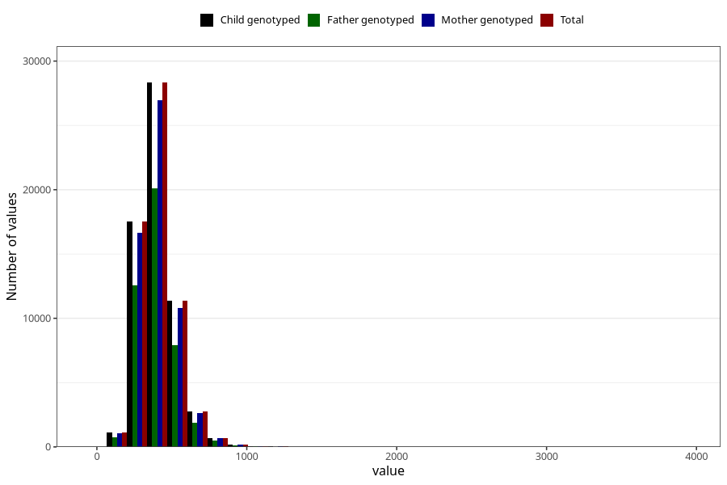

# magnesium
Variable mapping to `MAGNESIUM` in `Skjema2_beregning_CDW_v12`.
- Number of values:

| Value | Total | Child genotyped | Mother genotyped | Father genotyped |
| ----- | ----- | --------------- | ---------------- | ---------------- |
| Missing | 13178 | 13178 | 12654 | 6217 |
| Non-missing | 62130 | 62130 | 58996 | 43867 |
| 25th percentile | 320.9925 | 320.9925 | 320.93 | 320.035 |
| 50th percentile | 388.005 | 388.005 | 387.83 | 386.24 |
| 75th percentile | 467.29 | 467.29 | 467.1325 | 464.86 |
| Mean | 404.5356798648 | 404.5356798648 | 404.270520374263 | 402.417828207992 |
| Standard deviation | 128.552071366315 | 128.552071366315 | 128.143659655487 | 126.171433981624 |
| N | 62130 | 62130 | 58996 | 43867 |

