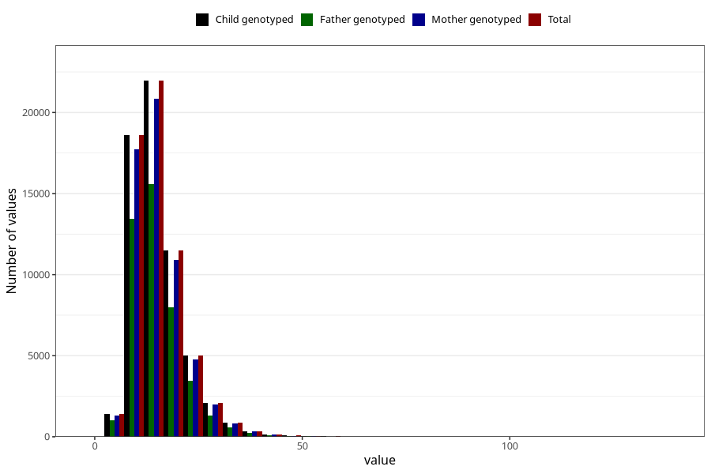

# polyunsaturated_fatty_acids
Variable mapping to `FLERUMETTET` in `Skjema2_beregning_CDW_v12`.
- Number of values:

| Value | Total | Child genotyped | Mother genotyped | Father genotyped |
| ----- | ----- | --------------- | ---------------- | ---------------- |
| Missing | 13178 | 13178 | 12654 | 6217 |
| Non-missing | 62130 | 62130 | 58996 | 43867 |
| 25th percentile | 11.02 | 11.02 | 11.02 | 10.94 |
| 50th percentile | 13.975 | 13.975 | 13.97 | 13.84 |
| 75th percentile | 18.0775 | 18.0775 | 18.06 | 17.87 |
| Mean | 15.2809269274103 | 15.2809269274103 | 15.2751952674758 | 15.1106499190736 |
| Standard deviation | 6.28463254515802 | 6.28463254515802 | 6.27500949012859 | 6.14212934401072 |
| N | 62130 | 62130 | 58996 | 43867 |

